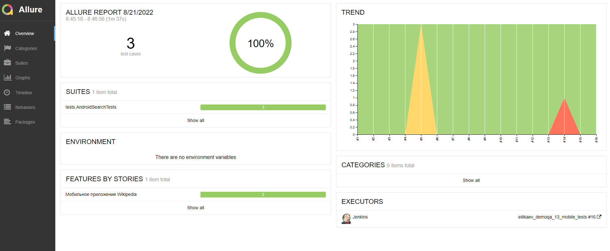

# Автоматизация тестирования приложений на Android:   Wikipedia

> Википедия - общедоступная универсальная интернет-энциклопедия со свободным контентом. 

# <a name="Содержание">Содержание:</a>
+ [Описание](#Описание)
+ [Используемые технологии](#ИспользуемыеТехнологии)
+ [Реализация проверок](#РеализацияПроверок)
+ [Запуск тестов](#ЗапускТестов)
  + [Запуск тестов локально из терминала](#ЗапускТестовЛокальноИзТерминала)
  + [Файлы с параметрами](#ФайлыСПараметрами)
  + [Запуск тестов из Jenkins](#ЗапускТестовИзJenkins)
+ [Оповещение в Telegram](#ОповещениеВTelegram)
+ [Отчет о результатах прохождения тестов в Allure Report](#ОтчетОРезультатахПрохожденияТестовВAllureReport)
+ [Интеграция с Allure TestOps](#ИнтеграцияСAllureTestOps)
  + [Список тестовых случаев в проекте](#СписокТестовыхСлучаевВПроекте)
  + [Запуск Jenkins задач из Allure TestOps](#ЗапускJenkinsЗадачИзAllureTestOps)
  + [Dashboards](#Dashboards)
+ [Интеграция с Jira](#ИнтеграцияСJira)
+ [Видео о прохождении тестов](#ВидеоОПрохожденииТестов)

# <a name="Описание">Описание</a>

# <a name="ИспользуемыеТехнологии">Используемые технологии</a>
<p align="center">


</p>


# <a name="РеализацияПроверок">Реализация проверок</a>

> Проверка  поиска в Wikipedia
> 
> Проверка вкладок на стартовой странице Wikipedia

# <a name="Запусктестов">Запуск тестов</a>

## <a name="ЗапускТестовЛокальноИзТерминала">Запуск тестов локально из терминала</a>

```bash
gradle clean android -DdeviceHost=browserstack
```

```bash
gradle clean android -DdeviceHost=emulation
```

```bash
gradle clean android -DdeviceHost=real
```

## <a name="ФайлыСПараметрами">Файлы с параметрами</a>
Browserstack параметры (_browserstack.properties_)
```properties
deviceName=Google Pixel 3
platformVersion=9.0
baseURL=http://hub.browserstack.com/wd/hub
```

Emulation параметры (_emulation.properties_)
```properties
deviceName=Pixel 4 API 30
platformVersion=11.0
baseURL=http://localhost:4723/wd/hub
```
> - _deviceName_ - название устройства
> - _platformVersion_ - версия андроида
> - _baseURL_ - базовый URL Browserstack
>

## <a name="ЗапускТестовИзJenkins">Запуск тестов из Jenkins</a>
```bash
clean android -DdeviceHost=${DEVICEHOST}
```
# <a name="ОповещениеВTelegram">Оповещение в Telegram</a>
Отправка уведомлений о результатах прохождения тестов осуществляется с помощью Telegram бота. 
<p  align="center">

</p>

# <a name="ОтчетОРезультатахПрохожденияТестовВAllureReport">Отчет о результатах прохождения тестов в Allure Report</a>
<p  align="center">

</p>
Список перечисления тестов с описанием шагов
<p  align="center">

</p>

<p  align="center">

</p>

# <a name="ИнтеграцияСAllureTestOps">Интеграция с Allure TestOps</a>
Allure TestOps предоставляет возможность командам создавать тестовую документацию, хранить, 
запускать и анализировать ручные и автоматические тесты в одном месте и в режиме реального времени.

## <a name="СписокТестовыхСлучаевВПроекте">Список тестовых случаев в проекте</a>

<p  align="center">

</p>

## <a name="ЗапускJenkinsЗадачИзAllureTestOps">Запуск Jenkins задач из Allure TestOps</a>
В Allure TestOps можно настроить запуск автотестов из Jenkins
<p  align="center">

</p>

## <a name="Dashboards">Dashboards</a>

<p  align="center">

</p>
# <a name="ИнтеграцияСJira">Интеграция с Jira</a>

# <a name="ВидеоОПрохожденииТестов">Видео о прохождении тестов</a>
<p align="center">

</p>